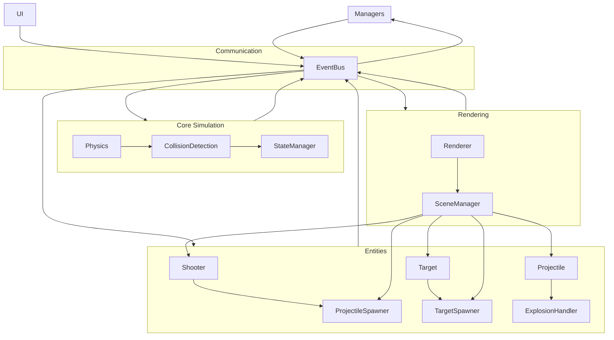

```mermaid
graph TD

  

subgraph Core["Core Simulation"]

    Physics --> CollisionDetection

    CollisionDetection --> StateManager

end

  

subgraph Rendering["Rendering"]

    Renderer --> SceneManager

end

  

subgraph Entities["Entities"]

    Shooter --> ProjectileSpawner

    Target --> TargetSpawner

    Projectile --> ExplosionHandler

end

  

subgraph Managers["Managers"]

    SceneManager --> Shooter

    SceneManager --> Target

    SceneManager --> Projectile

    SceneManager --> TargetSpawner

    SceneManager --> ProjectileSpawner

end

  

subgraph Communication["Communication"]

    EventBus

end

  

UI --> EventBus

Core --> EventBus

Rendering --> EventBus

Entities --> EventBus

Managers --> EventBus

  

EventBus --> Core

EventBus --> Rendering

EventBus --> Entities

EventBus --> Managers
```