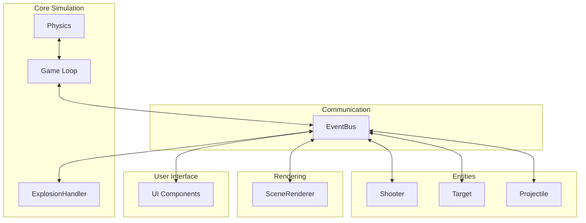
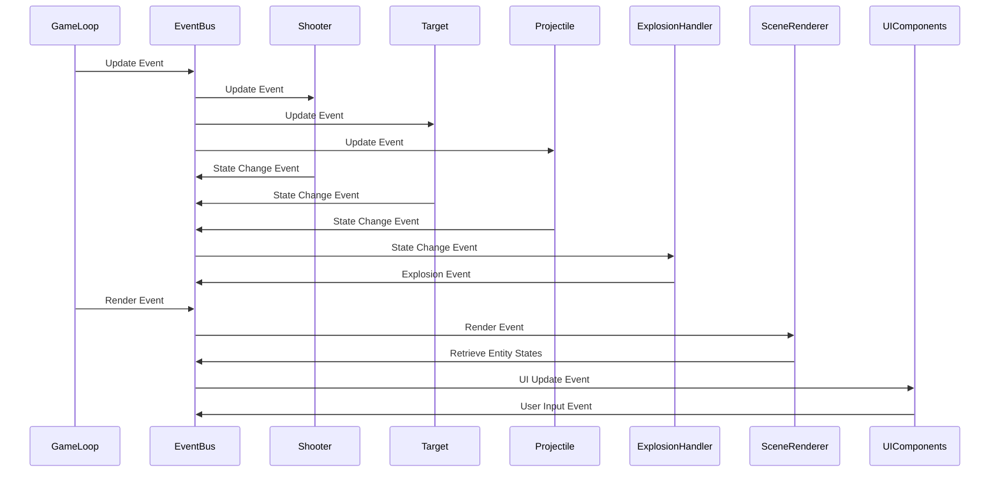

```
src/
  ├── core/
  │   ├── physics/
  │   │   ├── CollisionDetection.ts
  │   │   └── ExplosionHandler.ts
  │   └── GameLoop.ts
  │
  ├── entities/
  │   ├── Shooter.ts
  │   ├── Target.ts
  │   └── Projectile.ts
  │
  ├── rendering/
  │   └── SceneRenderer.ts
  │
  ├── ui/
  │   └── components/
  │       └── UIComponents.ts
  │
  ├── communication/
  │   └── EventBus.ts
  │
  ├── types/
  │   └── index.ts
  │
  ├── utils/
  │   └── /* utility functions */
  │
  ├── assets/
  │   ├── images/
  │   ├── models/
  │   └── /* other asset files */
  │
  ├── styles/
  │   └── /* CSS or SCSS files */
  │
  ├── index.html
  └── app.ts
```