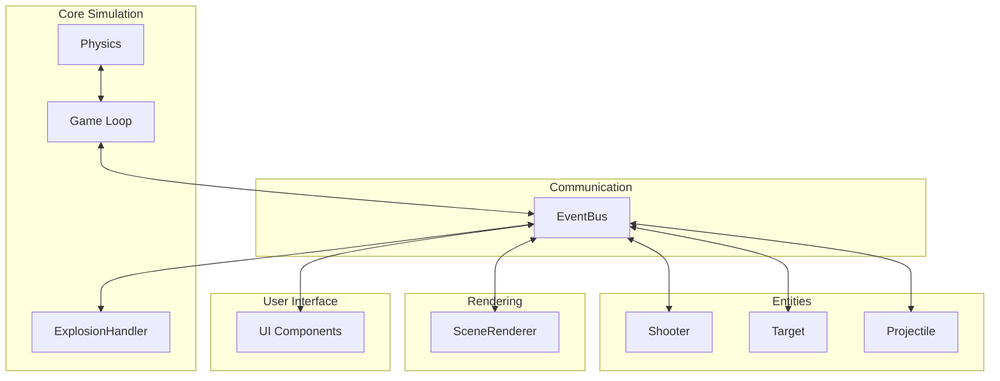

```mermaid
graph TD
    subgraph Core["Core Simulation"]
        Physics
        ExplosionHandler
        GameLoop["Game Loop"]
    end

    subgraph Entities["Entities"]
        Shooter
        Target
        Projectile
    end

    subgraph Rendering["Rendering"]
        SceneRenderer
    end

    subgraph UI["User Interface"]
        UIComponents["UI Components"]
    end

    subgraph Communication["Communication"]
        EventBus
    end

    Physics <--> GameLoop
    GameLoop <--> EventBus
    EventBus <--> ExplosionHandler
    EventBus <--> Shooter
    EventBus <--> Target
    EventBus <--> Projectile
    EventBus <--> SceneRenderer
    EventBus <--> UIComponents
```